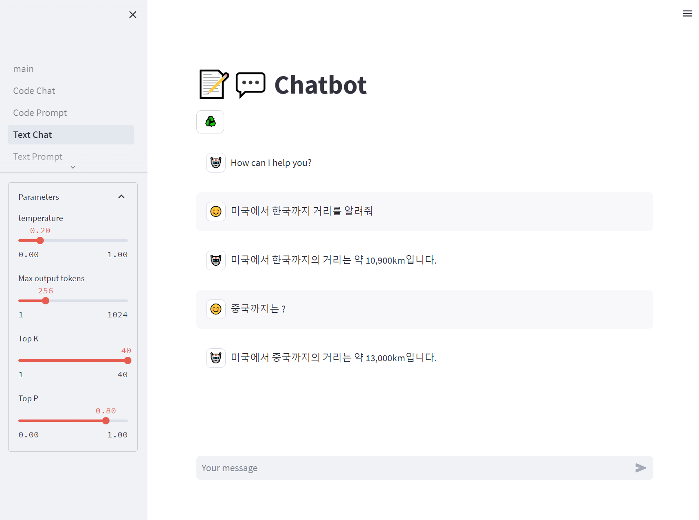
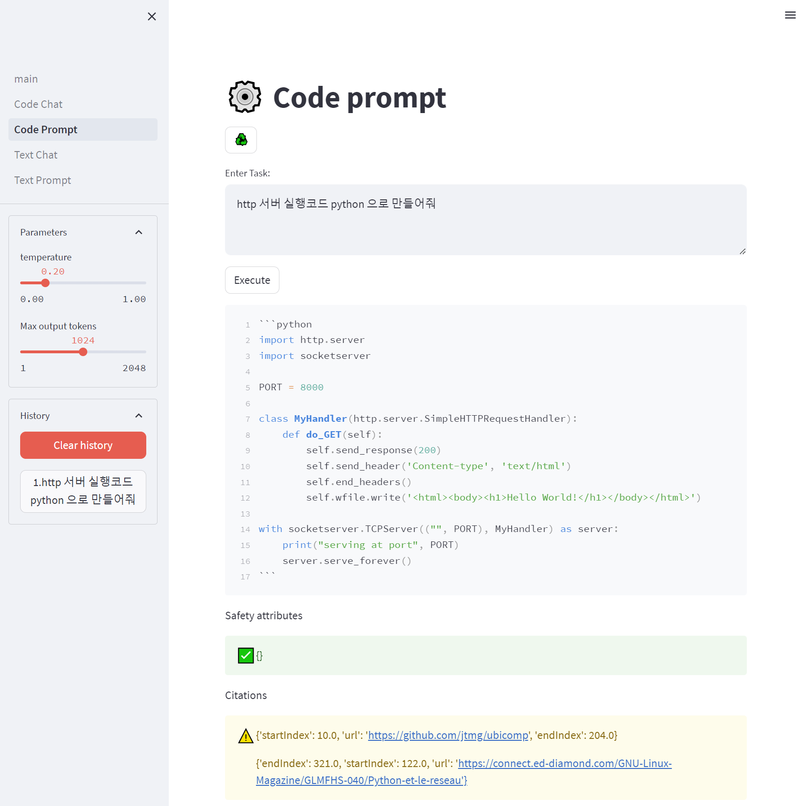
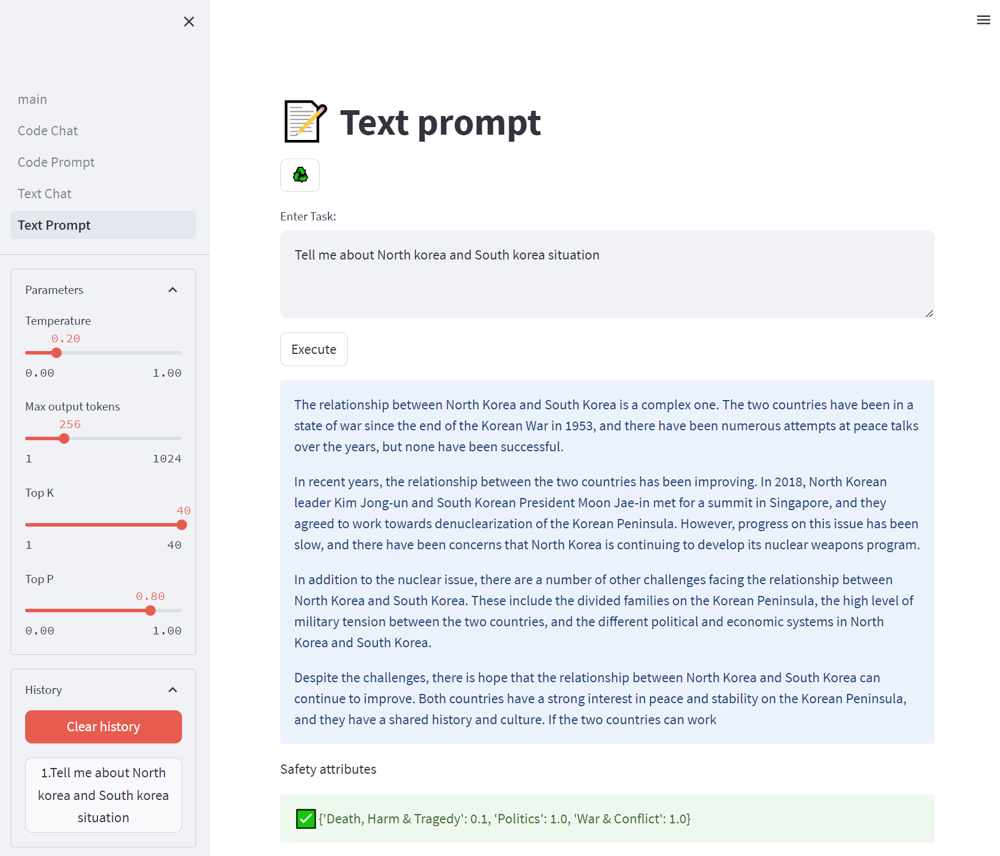
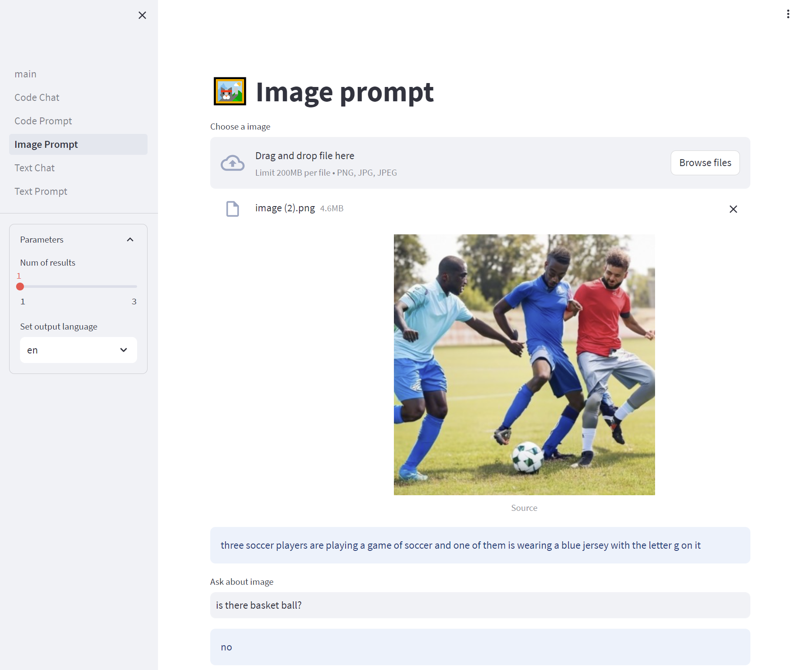

# Vertex AI LLM tester

## Brief
In this sample, you'll learn how to create LLM dashboard using Google Cloud LLM, Image API and streamlit

## Steps for setting
```
pip install -r requirements.txt             # Install libraries (tested on Python 3.10)
gcloud auth application-default login       # Set credential in your env
python -m streamlit run main.py             # Launch dashboard
```
<div align="center"></div>
<div align="center"></div>
<div align="center"></div>
<div align="center"></div>